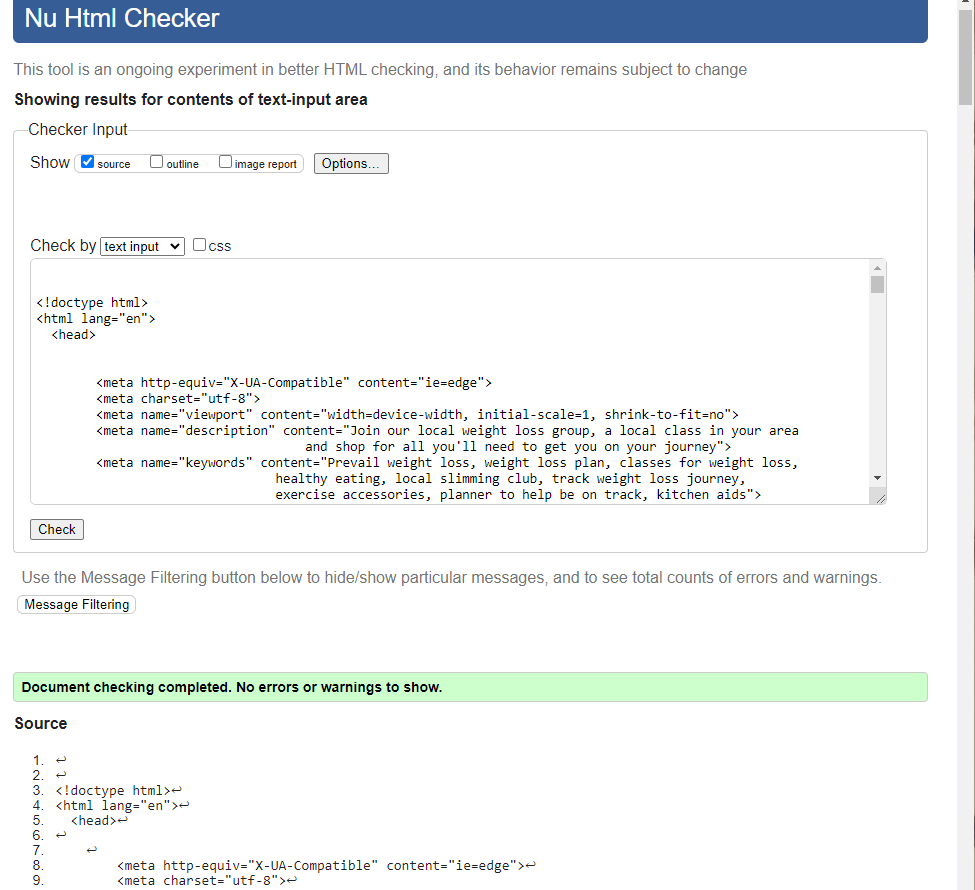
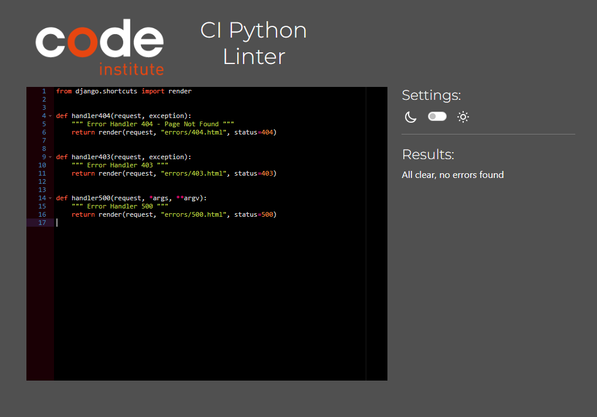
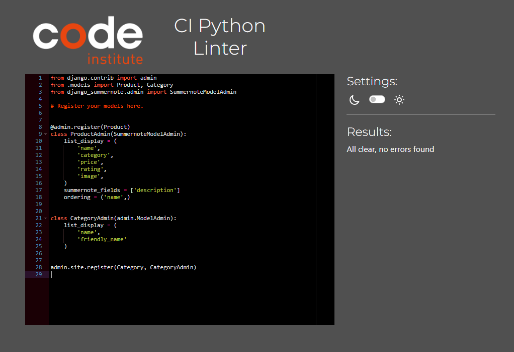
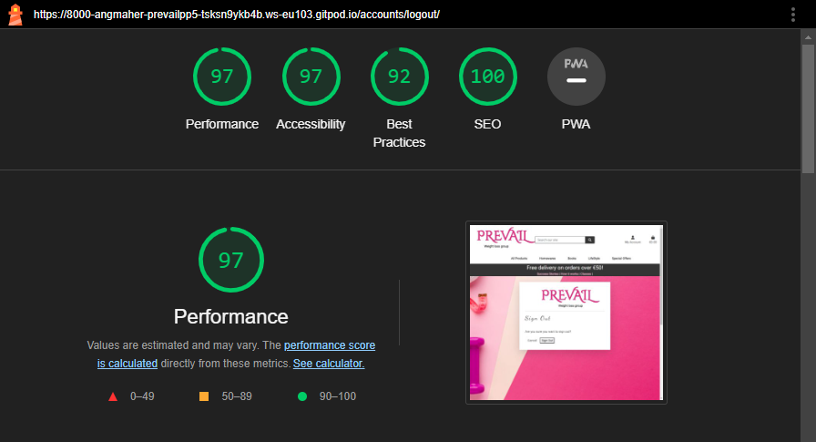

# Testing

Return back to the [README.md](README.md) file.

Throughout the development of this project, I've carried out numerous tests to ensure that the site works well. In this section you will find documentation of all tests carried out throughout the site.

## Code Validation

I have validated all of my code using the recommended tools for each language.

### HTML

I have used the recommended [HTML W3C Validator](https://validator.w3.org) to validate all of my HTML files.

| Page | Screenshot | Notes |
| --- | --- | --- |
| Home |  | Pass: No Errors |
| All Products  |  | Pass: No Errors |
| Product Detail |  | Pass: No Errors |
| How it works  |  | Pass: No Errors |
| Success Stories |  | Pass: No Errors |
| Story Detail|  | Pass: No Errors |
| Add Story |  | Pass: No Errors |
| Edit Story |  | Pass: No Errors |
| Delete Story |  | Pass: No Errors |
| Sign Up |  | Pass: No Errors |
| Sign In |  | Pass: No Errors |
| Log Out |  | Pass: No Errors |
| Checkout |  | Pass: No Errors only 1 warning |
| Checkout Success |  | Pass: No Errors |
| Profile |  | Pass: No Errors |
| List Categories  |  | Pass: No Errors |
| Add Category |  | Pass: No Errors |
| Delete Category |  | Pass: No Errors |
| Edit Category |  | Pass: No Errors |
| Delete Product |  | Pass: No Errors |
| Classes |  | Pass: No Errors |
| Class Detail |  | Pass: No Errors |
 Add Class |  | Pass: No Errors |
| Edit Class |  | Pass: No Errors |
| Delete Class |  | Pass: No Errors |
| Membership |  | Pass: No Errors |
| Membership form |  | Pass: No Errors |
| Footer|  | Pass: No Errors Tested seperate because was having issued with mailchimo code |

### CSS

I have used the recommended [CSS Jigsaw Validator](https://jigsaw.w3.org/css-validator) to validate all of my CSS files.

| File | Screenshot | Notes |
| --- | --- | --- |
| style.css |  | Pass: No Errors |
| checkout.css |  | Pass: No Errors |
| profile.css |  | Pass: No Errors |

### JavaScript

I have used the recommended [JShint Validator](https://jshint.com) to validate all of my JS files.

| File | Screenshot | Notes |
| --- | --- | --- |
| countryfields.js |  | Pass: No Errors |
| add_product.html (postloadjs) |  | Pass: No Errors |
| edit_product.html (postloadjs) |  | Pass: No Errors |
| products.html (postloadjs) |  | Pass: No Errors |
| bag.html (postloadjs) |  | Pass: No Errors |
| base.html (script) |  | Pass: No Errors |
| stripe_elements.js |  | pass no errors |

### Python

I have used the recommended [CI Python Linter](https://pep8ci.herokuapp.com) to validate all of my Python files.

| File | Screenshot | Notes |
| --- | --- | --- |
| Bag contexts.py |  | Pass: No Errors |
| Bag urls.py |  | Pass: No Errors |
| Bag views.py |  | Pass: No Errors |
| Checkout admin.py |  | Pass: No Errors |
| Checkout forms.py |   | Pass: No Errors |
| Checkout models.py |  | Pass: No Errors |
| Checkout signals.py |  | Pass: No Errors |
| Checkout urls.py |  | Pass: No Errors |
| Checkout views.py |  | Pass: No Errors |
| Checkout webhook_handler.py |  | Pass: No Errors |
| Checkout webhooks.py |  | Pass: No Errors |
| classes admin.py |  | Pass: No Errors |
| classes forms.py |  | Pass: No Errors |
| classes models.py |  | Pass: No Errors |
| classes urls.py |  | Pass: No Errors |
| classes views.py |  | Pass: No Errors |
| home urls.py |  | Pass: No Errors |
| home views.py |  | Pass: No Errors |
| membership admin.py |  | Pass: No Errors |
| membership forms.py |  | Pass: No Errors |
| membership models.py |  | Pass: No Errors |
| membership urls.py |  | Pass: No Errors |
| membership views.py |  | Pass: No Errors |python/
| prevail settings.py |  | Pass: No Errors |
| prevail urls.py |  | Pass: No Errors |
| prevail views.py |  | Pass: No Errors |
| products admin.py |  | Pass: No Errors |
| products forms.py |  | Pass: No Errors |
| products models.py |  | Pass: No Errors |
| products urls.py |  | Pass: No Errors |
| products views.py |  | Pass: No Errors |
| products widgets.py |  | Pass: No Errors |
| profile views.py |  | Pass: No Errors |
| profile forms.py |  | Pass: No Errors |
| profile models.py |  | Pass: No Errors |
| profile urls.py |  | Pass: No Errors |
| custom storage.py |  | Pass: No Errors |
| success stories admin.py |  | Pass: No Errors |
| success stories forms.py |  | Pass: No Errors |
| success stories models.py |  | Pass: No Errors |
| success stories urls.py |  | Pass: No Errors |
| success stories views.py |  | Pass: No Errors |

## Browser Compatibility

I've tested my deployed project on multiple browsers to check for compatibility issues.

| Browser | Screenshot | Notes |
| --- | --- | --- |
| Chrome |  | Works as expected |
| Safari |  | Works as expected |
| Edge |  | Works as expected |

## Lighthouse Audit

I've tested my deployed project using the Lighthouse Audit tool to check for any major issues.

| Page  | Screenshot | Notes |
| --- | --- | --- |
| Home |  | No major warnings |
| Products |  | No major warnings |
| Product detail |  | No major warnings |
| Add a Product |  | No major warnings |
| Bag |  | No major warnings |
| Checkout |  | No major warnings |
| Checkout Success |  | No major warnings |
| Sign-in |  | No major warnings |
| Register |  | No major warnings |
| Membership |  | No major warnings |
| Class Detail |  | No major warnings |
| Member Form |  | No major warnings |
| List of Classes |  | No major warnings |
| Add Class |  | No major warnings |
| Edit a Class |  | No major warnings |
| Delete Class |  | No major warnings |
| List of Classes |  | No major warnings |
| Add Class |  | No major warnings |
| Edit a Class |  | No major warnings |
| Delete Class |  | No major warnings |
| Add Success Story |  | No major warnings |
| Edit Success Story  |  | No major warnings |
| Delete Story |  | No major warnings |
| How it works |  | No major warnings |
| Profile |  | No major warnings |
| Sign Out |  | No major warnings |
| Delete Product |  | No major warnings |
| Home |  | No major warnings |

## Defensive Programming

Defensive programming was manually tested with the below user acceptance testing:

| Page | User Action | Expected Result | Pass/Fail | Comments |
| --- | --- | --- | --- | --- |
| **Home Page** | | | | |
| | Click on Logo | Redirection to Home page | Pass | |
| | Click on Shop Now button | Redirection to All Products page | Pass | |
| | Click on Join a class button | Redirection to Membership page | Pass | |
| **All Products Page** | | | | |
| | Click on All Products link in navbar | Redirection to All Products page | Pass | |
| | Click on All Products By Price link in navbar | Redirection to All Products page | Pass | Products sorted by price low to high |
| | Click on All Products By Rating link in navbar | Redirection to All Products page | Pass | Products sorted by Rating sorted high to low |
| | Click on All Products By Category in navbar | Redirection to All Products page | Pass | Products sorted by category A-Z |
| | Click on Kitchen link in navbar | Redirection to All Products page | Pass | Products filtered to kitchen products |
| | Click on Bathroom Scales in navbar | Redirection to All Products page | Pass | Products filtered to Bathroom Scales |
| | Click on Games By Sony link in navbar | Redirection to All Products page | Pass | Products filtered to Games on Sony consoles |
| | Click on Consoles By Nintendo link in navbar | Redirection to All Products page | Pass | Products filtered to Nintendo consoles |
| | Click on Consoles By Sega link in navbar | Redirection to All Products page | Pass | Products filtered to Sega consoles |
| | Click on Consoles By Sony link in navbar | Redirection to All Products page | Pass | Products filtered to Sony consoles |
| | Click on Price (low to high) in Sort by... dropdown | Redirection to All Products page | Pass | Products sorted by price low to high |
| | Click on Price (high to low) in Sort by... dropdown | Redirection to All Products page | Pass | Products sorted by price high to low |
| | Click on Name (A-Z) in Sort by... dropdown | Redirection to All Products page | Pass | Products sorted alphabetically A-Z |
| | Click on Name (Z-A) in Sort by... dropdown | Redirection to All Products page | Pass | Products sorted alphabetically Z-A |
| | Click on Year (oldest to newest) in Sort by... dropdown | Redirection to All Products page | Pass | Products sorted by release year old to new |
| | Click on Year (newest to oldest) in Sort by... dropdown | Redirection to All Products page | Pass | Products sorted by release year new to old |
| | Click on Platform (A-Z) in Sort by... dropdown | Redirection to All Products page | Pass | Products sorted by platform A-Z |
| | Click on Platform (Z-A) in Sort by... dropdown | Redirection to All Products page | Pass | Products sorted by platform Z-A |
| | Click on Product card image | Redirection to Product Detail page for that product | Pass | |
| | Click on Product card name | Redirection to Product Detail page for that product | Pass | |
| | Click on Category on card | Redirection to Products page for that category | Pass | |
| | Click on Edit product button | Redirection to Edit Product page for that product | Pass | Button only appears if logged in user is an admin |
| | Click on Delete product button | Redirection to Delete Product confirmation page for that product | Pass | Button only appears if logged in user is an admin |
| **Product Detail Page** | | | | |
| | Click on Keep Shopping button | Redirection to All Products page | Pass | |
| | Click + button on quantity selector form | Quantity number increases if number + 1  | Pass | |
| | Click - button on quantity selector form | Quantity number decreases if current quantity is greater than one | Pass | |
| | Click Add To Bag button | Product is added to basket and quantity is set to the user's choice | Pass | |
| | Click Add To Bag button when user already has the product in their basket | Quantity selected is added to the existing quantity in the user's basket for the product | Pass | Only applicable if quantity being added ||
| | Click on Category | Redirection to Products page for that category | Pass | |
| | Click on edit product button | Redirection to Edit Product page for that product | Pass | Button only appears if logged in user is an admin |
| | Click on delete product button | Redirection to Delete Product confirmation page for that product | Pass | Button only appears if logged in user is an admin |
| **Search** | | | | |
| | Enter word into search bar that appears in at least one product's name or description | Redirection to Products page | Pass | Products filtered to only show products containing search term |
| | Enter word into search bar that doesn't appear in any product's name or description | Redirection to Products page | Pass | Products page is empty and shows user that 0 products were returned |
| | Enter nothing into search bar | Redirection to Products page | Pass | Error message shows and lets user know they entered nothing into the search bar and all products are displayed |
| **Sign Up Page** | | | | |
| | Click on Register button under account on nav menu | Redirection to Sign Up page | Pass | |
| | Enter valid email address | Field will only accept email address format | Pass | |
| | Enter valid password (twice) | Field will only accept password format | Pass | |
| | Click Sign Up button on sign up page | Sends confirmation email and lets user know to check their email | Pass | |
| | Click link in confirmation email | Redirects user to sign in page | Pass | |
| **Sign In Page** | | | | |
| | Click on the Login button under account on nav menu | Redirection to Login page | Pass | |
| | Enter valid email address | Field will only accept email address format | Pass | |
| | Enter valid password | Field will only accept password format | Pass | |
| | Click Login button on login page | Redirects user to homepage | Pass | |
| | Click Forgot Password | Redirects user to password reset page | Pass | |
| | Sign in before confirming account | Redirects to message reminding user to confirm email address | Pass | |
| **Log Out Page** | | | | |
| | Click Logout button | Redirects user to logout page | Pass | Confirms logout first |
| | Click Confirm Logout button | Redirects user to home page | Pass | |
| **User Profile Page** | | | | |
| | Click on the My Profile link under account on nav menu | Redirection to User profile page page | Pass | Only shows for logged in users |
| | Click Update Information button | Saves form contents to be default information for user | Pass | Default information is cleared if form is submitted while blank |
| | Click Order Number for previous order in Order History | Redirects user to order confirmation page for that order | Pass | |
| | Brute forcing the URL to profile if not logged in | User given an error | Pass | Redirects user to error page |
| **Bag** | | | | |
| | Click Basket icon in main nav | Redirects user to basket page | Pass | Shows back to shop button if basket is empty |
| | Click Confirm Logout button | Redirects user to home page | Pass | |
| | Click + button on quantity selector form | Quantity number increases if number + 1 is less than or equal to product's stock | Pass | |
| | Click - button on quantity selector form | Quantity number decreases if current quantity is greater than one | Pass | |
| | Click + button on quantity selector form if quantity is at the product's stock | Nothing | Pass | |
| | Click update button under quantity selector form | Updated quantity of product in basket to number in quantity select form | Pass | |
| | Click remove button under quantity selector form | Removes product from basket completely | Pass | |
| | Manually enter number greater than product stock in quantity selector form | Error message appears letting the user know what the product's stock is | Pass | |
| | Click on discount apply button with empty discount field | Message appears letting user know the field can't be blank | Pass | |
| | Click on discount apply button with invalid code in the discount field | Error message shows letting user know the code entered doesn't exist | Pass | |
| | Click on discount apply button with valid code in the discount field | Alert message shows letting user know the discount has been added | Pass | |
| | Discount code added successfully | Percentage gets taken off the basket total, discount form is replaced with discount amount | Pass | |
| | Click on trash icon next to discount amount | Discount removed and discount code form reappears in place of discount amount | Pass | |
| | Remove item from basket that brings total to below €50 | Delivery goes from FREE to 10% of the total cost of the basket contents | Pass | |
| | Click on Keep Shopping button | Redirection to All Products page | Pass | |
| | Click on Secure Checkout button | Redirection to checkout page | Pass | |
| **Checkout** | | | | |
| | Click on Secure Checkout button in basket | Redirection to checkout page | Pass | |
| | Click Complete Order button without all required fields filled out | Message letting user know that required fields need to be filled out | Pass | |
| | Click Save delivery information to profile button | User's default information will be set to whatever is filled in at the checkout on order completion | Pass | Only visible to logged in users |
| | Click on Create an account link | Redirection to sign up page | Pass | Only visible to logged out users |
| | Click on login link | Redirection to sign in page | Pass | Only visible to logged out users |
| | Click Complete Order button without card details filled out | Message letting user know that their card number is incomplete | Pass | |
| | Click Complete Order button with all details filled out | Loading spinner appears and order is processed | Pass | |
| | Order completed | Order confirmation email is sent to the user and redirection to checkout success page | Pass | |
| **Checkout Success Page** | | | | |
| | Order completed | Redirection to checkout success page | Pass | |
| | Click Checkout latest deals button | Redirects user to all products page | Pass | Only visible if user comes to this page straight from order completion |
| | Click Back to profile button button | Redirects user to their profile | Pass | Only visible if user comes to this page from the order history list on their profile |
| **Add Product Page** | | | | |
| | Click Add New Product link from Admin dropdown | Redirects admin to add product page | Pass | User can only see this if they're logged in as an admin |
| | Click Cancel button | Redirects admin to all products page | Pass | |
| | Click Add Product button with form filled correctly | Creates a new product on the site using the information provided | Pass | |
| | Click Add Product button with form filled incorrectly | Message appears letting the admin know to fill in the required form fields | Pass | |
| | Set product's stock to be less than 1 | Product will be created but appear on the site as sold out with add to basket button disabled | Pass | |
| | Click Add Product button with no image set | Product will be created but will be displayed with default product image | Pass | |
| | Brute forcing the URL to add a new product  if not logged in | User given an error | Pass | Error message stating only store owners can do that |
| | Brute forcing the URL to add a new product if not an admin | User given an error | Pass | Redirects user to error page |
| **Edit Product Page** | | | | |
| | Click edit icon on product | Redirects user to Edit Product page | Pass | User must be an admin to see icon and access this page |
| | Click Cancel button | Redirects admin to all products page | Pass | |
| | Click Update Product button with form filled correctly | Updates product with information provided | Pass | |
| | Click Update Product button with form filled incorrectly | Message appears letting the admin know to fill in the required form fields | Pass | |
| | Click Update Product button with no image set | Product will be updated but will be displayed with default product image | Pass | |
| | Brute forcing the URL to edit a new product  if logged in | User given an error | Pass | Error message stating only store owners can do that |
| | Brute forcing the URL to edit a product if not an admin | User given an error | Pass | Redirects user to sign in |
| **Delete Product Page** | | | | |
| | Click delete icon on product | Redirects user to Edit Product page | Pass | User must be an admin to see icon and access this page |
| | Click Cancel button | Redirects admin to product detail page for selected product | Pass | |
| | Click Delete Product button | Product will be completely deleted from the site | Pass | |
| | Brute forcing the URL to delete a new product  if not logged in | User given an error | Pass | Error message stating only store owners can do that |
| | Brute forcing the URL to delete a product if not an admin | User given an error | Pass | Redirects user to login page |
| **Add Classes Page** | | | | |
| | Click Class Management link from Account dropdown | Redirects admin to add Class page | Pass | User can only see this if they're logged in as an admin |
| | Click Cancel button | Redirects admin to Classes List | Pass | |
| | Click Add Class button with form filled correctly | Creates a new class on the site using the information provided | Pass | |
| | Click Add Class button with form filled incorrectly | Message appears letting the admin know to fill in the required form fields | Pass | |
| | Brute forcing the URL to add a new class  if not logged in | User given an error | Pass | Error message stating only store owners can do that |
| | Brute forcing the URL to add a new class if not an admin | User given an error | Pass | Redirects user to error page |
| **Edit Classes Page** | | | | |
| | Click edit icon on class list | Redirects user to Edit class page displaying the class details | Pass | User must be an admin to see icon and access this page |
| | Click Cancel button | Redirects admin to class list | Pass | |
| | Click Update class button with form filled correctly | Updates class with information provided | Pass | |
| | Click Update class button with form filled incorrectly | Message appears letting the admin know to fill in the required form fields | Pass | |
| | Brute forcing the URL to add a new class if not logged in | User given an error | Pass | Error message stating only store owners can do that |
| | Brute forcing the URL to edit a class if not an admin | User given an error | Pass | Redirects user to sign in |
| **Delete Classes Page** | | | | |
| | Click delete icon on class | Redirects user to Delete class page | Pass | User must be an admin to see icon and access this page |
| | Click Cancel button | Redirects admin to class list | Pass | |
| | Click Delete Post button | Class will be completely deleted from the site | Pass | |
| | Brute forcing the URL to delete a class  if not logged in | User given an error | Pass | Error message stating only store owners can do that |
| | Brute forcing the URL to delete a class if not an admin | User given an error | Pass | Redirects user to sign in |
| **Add Success Stories Page** | | | | |
| | Click Story Management link from My Account dropdown | Redirects admin to add success story page | Pass | User can only see this if they're logged in as an admin |
| | Click Cancel button | Redirects admin to Success Stories | Pass | |
| | Click Add New Stroy button with form filled correctly | Creates a new story on the site using the information provided | Pass | |
| | Click Add New Story button with form filled incorrectly | Message appears letting the admin know to fill in the required form fields | Pass | |
| | Click Add New Story button with no image set | Story will be created but will be displayed with default success story image | Pass | |
| | Brute forcing the URL to add a success story if not logged in | User given an error | Pass | Error message stating only store owners can do that |
| | Brute forcing the URL to add a success story if not an admin | User given an error | Pass | Redirects user to sign in |
| **Edit Success Stories Page** | | | | |
| | Click edit icon on the story post | Redirects user to Edit Story page displaying the story details | Pass | User must be an admin to see icon and access this page |
| | Click Cancel button | Redirects admin to Success Stories | Pass | |
| | Click Edit Story button with form filled correctly | Updates Story with information provided | Pass | |
| | Click Edit Story button with form filled incorrectly | Message appears letting the admin know to fill in the required form fields | Pass | |
| | Click Edit Story button with no image set | success story will be updated but will be displayed with default success story image | Pass | |
| | Brute forcing the URL to edit a success story if not logged in | User given an error | Pass | Error message stating only store owners can do that |
| | Brute forcing the URL to edit a success story if not an admin | User given an error | Pass | Redirects user to sign in |
| **Delete Success Sroties Page** | | | | |
| | Click delete icon on success story | Redirects user to Delete Story page | Pass | User must be an admin to see icon and access this page |
| | Click Cancel button | Redirects admin to Success Stories | Pass | |
| | Click Delete Post button | Story will be completely deleted from the site | Pass | |
| **Add Category Page** | | | | |
| | Click Category link from My Account dropdown | Redirects admin to List of categoires page | Pass | User can only see this if they're logged in as an admin |
| | Click Add Category button | Redirects admin to form to add new category | Pass | |
| | Click Cancel button | Redirects admin back to list of categories | Pass | |
| | Click Add Category button with form filled correctly | Creates a new category on the site using the information provided | Pass | |
| | Click Add Category button with form filled incorrectly | Message appears letting the admin know to fill in the required form fields | Pass | |
| | Brute forcing the URL to add a new category  if not an admin | User given an error | Pass | Error message stating only store owners can do that |
| | Brute forcing the URL to add a new category if not signed in | User given an error | Pass | Redirects user to login in |
| **Edit Category Page** | | | | |
| | Click edit icon on category list | Redirects user to Edit Category page | Pass | User must be an admin to see icon and access this page |
| | Click Cancel button | Redirects admin back to Category list | Pass | |
| | Click Update Category button with form filled correctly | Updates category with information provided | Pass | |
| | Click Update Category with form filled incorrectly | Message appears letting the admin know to fill in the required form fields | Pass | |
| | Brute forcing the URL to edit a category if not an admin | User given an error | Pass | Redirects user to login page |
| **Delete Category Page** | | | | |
| | Click delete icon on category list | Redirects user to Delete Category page | Pass | User must be an admin to see icon and access this page |
| | Click Cancel button | Redirects admin to Category list | Pass | |
| | Click Delete Category button | Category will be completely deleted from the site | Pass | |
| | Brute forcing the URL to delete a category if not an admin | User given an error | Pass | Redirects user to login page |
| **Footer** | | | | |
| | Click Home link in footer | Redirects user to home page | Pass | |
| | Click Join Now link in footer | Redirects user to Membership page | Pass | |
| | Click Shop link in footer | Redirects user to Products page | Pass | |
| | Click Facebook link in footer | Opens My Facebook account clicked in a new tab | Pass | |
| | Click on About Us in footer | Redirection to How it works page | Pass | |
| | Click on Success Stories in footer | Redirection to Success Stories page | Pass | |
| | Click on My Account in footer | Redirection to Profile page | Pass | |
| | Click on Consoles By Sega link in footer | Redirection to All Products page | Pass | Products filtered to Sega consoles |
| | Click on Consoles By Sony link in footer | Redirection to All Products page | Pass | Products filtered to Sony consoles |
| | Click on Subscribe button on blank newsletter form | Error message appears telling user email is a required field | Pass | |
| | Click on Subscribe button on filled newsletter form | Alert message "Thanks for Subscribing" | Pass | |
| | Try to subscribe to newsletter with already subscribed email address | Error message "You're already subscribed, your profile has been updated. Thank you!" | Pass | |

## User Story Testings

The following are user stories I've implemented with screenshots to prove.

| User Story | Pass |
| --- | --- |
| As a Site User - for the first time I can see what the site's purpose is so that I can decide whether or not to continue on the site. | PASS |
| As a Site User I can easily see the options to navigate around the site so that I can find what I want with ease. | PASS |
| As a Site User I can view a list of all products so that I can browse through all products. | PASS |
| As a Site User I can easily filter products into different categories so that I can just look at what I'm interested in. | PASS |
| As a Site User I can see a detailed view of the product so that I can get more details before I add to cart. | PASS |
| As a Site User I can see a detailed view of the product so that I can get more details before I add to cart. | PASS |
| As a Site User I can delete on item from the checkout bag so that I have an option to change my mind. | PASS |
| As a Site User I can change the quantity of the product so that I can buy multiple at the same time. | PASS |
| As a Site User I can continue shopping when I add Item to bag so that I have an easy way of doing it from the detail page or checkout bag. | PASS |
| As a Site User I can see a breakdown of price so that I can see how much shipping will be before I buy | PASS |
| As a Sit User I can see a summary of what I'm buying when I fill in my details so that I can check everything is correct before I commit. | PASS |
| As a site user I want to be able to receive an order confirmation email after I purchase from the shop so that I can have a record of what I've purchased in my email inbox | PASS |
| As a site user I want to be able to create an account on the site so that I can save my billing and shipping details and see a history of my purchases on my account | PASS |
| As a Site User I can become a Prevail member with ease so that I can quickly sign up without going through the whole website. | PASS |
| As a Site User I can become a Prevail member with ease so that I can quickly sign up without going through the whole website. | PASS |
| As a site admin - Prevail Management I want to be able to delete products from the site so that I can remove any products that are no longer being supplied by the site | PASS |
| As a site admin - Prevail management I want to be able to edit existing products so that I can ensure that all product listings are up to date and accurate | PASS |
| As a site admin I want to be able to create new products from the front end so that I can easily add new products to the site | PASS |
| As a site user I want to be able to sign up for the site's mailing list so that I can receive offers and news in my inbox | PASS |
| As a Site admin/prevail manager I can display success stories of members so that I can show Site Users how successful our group can be and encourage them to join. | PASS |
| As a site admin I want to be able to set appropriate keywords on site pages so that I can increase the chances potential customers will find the site when searching to purchase records on Google | PASS |
| As a Site User I can set up an account so that I can check past purchases and save my details. | PASS |
| As a roleeasily login and logoutcapability so that access my personal account information. | PASS |
| As a Site User I can see a list of items I have placed in bag so that I can see what I am purchasing | PASS |
| As a registered user I want to be able to edit the details saved to my account so that I can keep my details up to date | PASS |

The following are user stories I wasn't able to implement

| User Story | Screenshot |
| --- | --- |
| As a Site admin - Prevail Manager I can display a post on the logged-in page of members so that I can display how each class is doing each week. | N/A |
| As a prevail member I want to be able to view class on the website so that I can feel part of the community and see how other classes are doing. | N/A |
| As a Site admin - Prevail Manager I can display a post on the logged-in page of members so that I can display how each class is doing each week. | N/A |
| As a site admin -prevail manager I want to be able to edit existing updates so that I can fix an error without having to delete and re-do | N/A |

## Bugs

| Bug | Issue| Fix |
| --- | --- | --- |
| Footer | I couldnt get the footer to stay at the bottom the page when different pages had different heights. | min-height: cal(100vh - 164px); in css file |
| Spinner on checkout | Couldnt get the spinner in the checkout to work | class on one div had underscore instead of dash |
| the credit card stop showing up | credit card payment failed to show after working all along. | after a  lot of aid from tutors and mentor finally found that the link for jquery in the base template had been deleted and we think might be connected to the next problem,and was unsaved when gitpod failed. |
| local payments stopped working | payments on the local server stopped working but continueed to work on heroku | after going back over my commits I realised on the day they stopped working gitpod had stalled and kicked me out. When I logged back in my gitpod address had changed from eu-102 to eu-103, I had changed the new address in the allowed hosts but forgot to change it in stripe for the payments. |

## Unfixed Bugs

- only one main issue with the site and thats the photos for the success stories.  I had the perfect pictures all set up and received an email from AWS advising that I was going over 2000 limit, after investigating I found the photos for the success stories were too big, unwilling to pay for the service I decided to delete them. I then start searching for before and afer photos for free and literally could not find anything good to use. The two I found for the placeholder are not at all what works but due to the time constraints I did not have the time to focus on this one issue.  If I was to do this for a real business I would look into alternitive options for storing photos, and take the photos myself.